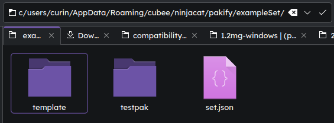
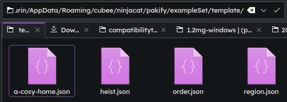
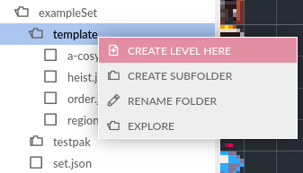
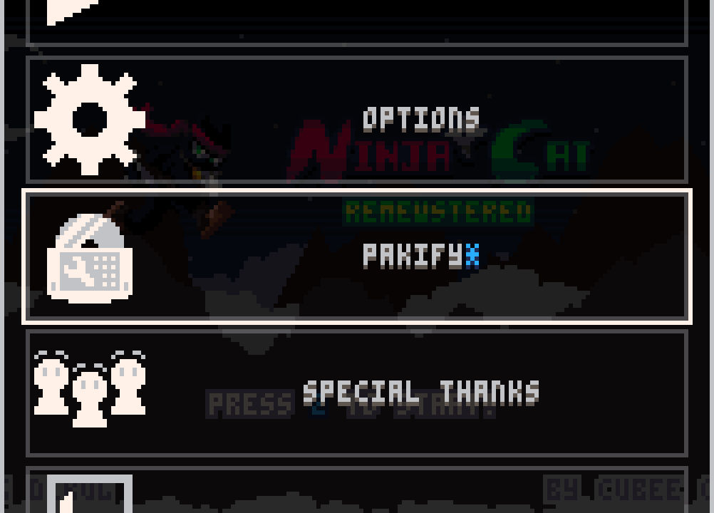
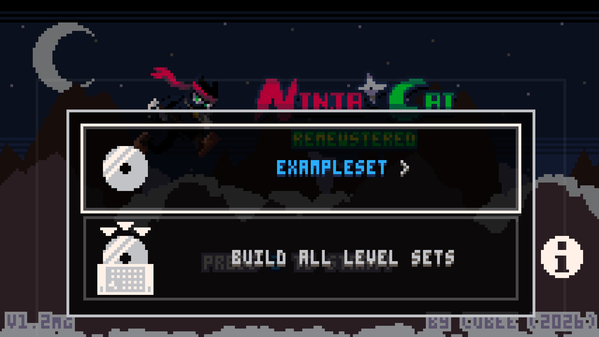
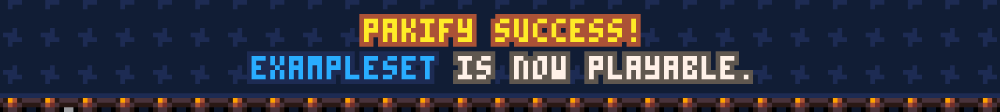
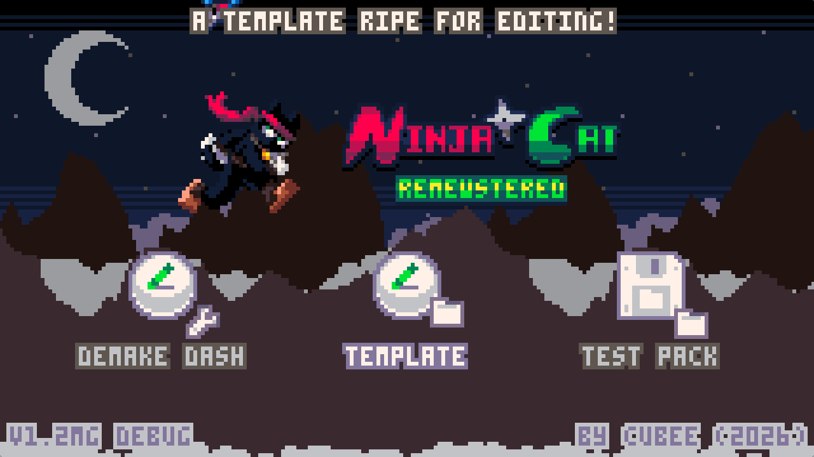
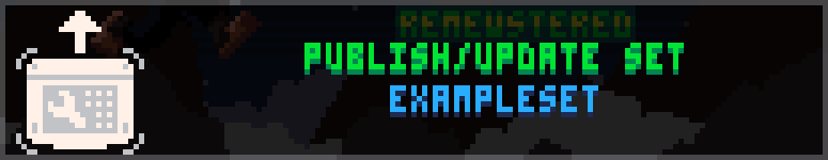

# Setup (Integrated)

This page is for the version of pakify built-in to Ninja Cat Remewstered. For the Python version, see [Setup (pakify Standalone)](Setup%20Standalone.md).

You will need:
- Ogmo Editor 3 (from [here](https://ogmo-editor-3.github.io/) or a compatible version)
- Ninja Cat Remewstered 1.2mg or higher

## Required Information

The Development Folder is in the following locations:
- Windows: `C:\Users\<user>\AppData\Roaming\cubee\ninjacat\pakify`
- Linux: `/home/<user>/.config/cubee/ninjacat/pakify`

The Custom Levels Folder is in the following locations:
- Windows: `C:\Users\<user>\AppData\Roaming\cubee\ninjacat\customPacks`
- Linux: `/home/<user>/.config/cubee/ninjacat/customPacks`

The Development Folder should be formatted like so:
- `pakify/` < Development Folder
  - `.assets/` < Ogmo Project assets folder
  - `setA/` < Level Set
    - `regionA/` < Region Folder
      - `levelA.json` < Ogmo Levels
      - `levelB.json`
      - `region.json` < [Region Properties](Region%20Properties.md)
      - `order.json` < Level Order
    - `regionB/` < Region Folder
      - `levelA.json` < Ogmo Level
      - `region.json` < [Region Properties](Region%20Properties.md)
      - `order.json` < Level Order
    - `set.json` < [Set Properties](Set%20Properties.md)
  - `ninja-cat-remewstered.ogmo` < [Ogmo Project](Ogmo%20Project.md)

That is, each "Set" of Region Packs is stored in its own folder. This is for organisational purposes, and so that it is possible to upload sequential Regions to the Steam Workshop as one item.

Here's a visual for a Level Set folder:



And another for a Region folder:



In fact, the folder name of the Level Set is more or less irrelevent; Workshop Sets are downloaded to Steam's `workshop` folder and named with their Workshop ID.
- The Development Folder is only for developing Level Sets. To play Level Sets from outside the Workshop, add them to the Custom Levels Folder instead.

Sets will be built directly into the Custom Levels Folder, with a structure like so:
- `customPacks/` < Custom Levels Folder
  - `setA/` < Level Set
    - `set.json` < Set Metadata
    - `regionA.ncl` < Region
    - `regionB.ncl` < Region
  - `setB/` < Level Set
    - `set.json` < Set Metadata
    - `levels.ncl` < Region

## Basic Workflow
Usage of Ogmo Editor itself will not be covered here.

### Prerequisites
Place the `.ogmo` file and `.assets` folder from this repository into your Development Folder, like so:
- `pakify/`
  - `.assets/`
  - `ninja-cat-remewstered.ogmo`

These files are required for level creation and are not included with the game. To obtain them:
- Go to the main [GitHub Page](https://github.com/cubee-cb/ncr-pakify/).
- Click the green `Code` button and then `Download ZIP`.
- Extract the ZIP file.

### Steps
There is an example Level Set included, [`exampleSet`](../exampleSet).
- You can copy this folder directly into your Development Folder if you like.

#### If you're making a new Level Set or Region:
- Go to the Level Development Folder.
- Create the Structure for your level set.
  - See [Set Properties](Set%20Properties.md) and [Region Properties](Region%20Properties.md) for templates, and [Required Information](#required-information) for file structure.


#### To create a Level for a Region:
- Using Ogmo Editor, open the `.ogmo` project file.
- Find the Region's folder, then right click it and press **Create Level Here**. Name it whatever you like.
  - Remember to add it into the Region's `order.json`. See [Alternate Levels](Alternate%20Levels.md) for modifier-specific level replacement.



#### And finally, to pakify:
- Open Ninja Cat Remewstered.
- Go to the `System Menu` > `Options` > `Technical` > `Pakify`



- Select the Level Set to run through pakify, then select `Build`.
  - !! You will be returned to the title screen automatically when it finishes.





- Once complete, go to `New Game` in the main menu and see if your Regions are there.



#### todo: Publishing to Steam Workshop:
- You may only upload Level Sets you have the source for. That is, Sets that Pakify can see.
- Go to the `System Menu` > `Options` > `Technical` > `Pakify`


- Select the Level Set to publish, then select `Publish Level Set`.
  - If the Level Set has already been published, it will be updated instead.
  - !! You will be returned to the title screen automatically when it finishes.



- Pakify will build the Level Set and upload it with the details specified in `set.json`.
  - The Set will have a `workshop.json` file added to its project folder. Do not remove or modify this; it contains the Workshop ID of the Set.

### Troubleshooting
If your pack does not appear in the `New Game` menu:
- Try running Ninja Cat Remewstered through a console, then rebuild.
  - It will provide detailed output about what exactly pakify or the Level Set importer is failing on -> look for lines tagged with `[pakify]`.
- Make sure your files are formatted correctly.

Pakify doesn't see the pack:
- Make sure it's in the right folder and contains a properly-formatted `set.json`.

### `set.json` example
```json
{
  "id": "template",
  "author": "author",
  "revision": 1,
  "requireGameVersion": 1,

  "regions": [
    "templateRegion",
    "templateRegion2"
  ]
}
```

### `order.json` example
Format:
- `<filename>` - e.g. `epicLevel1.json`
- `<filename>:<alternate>` - e.g. `epicLevel1.json:pacifism`

The indentation here is optional; I use it to more easily tell which levels are Alternates.
```json
[
  "1.json",
  "2.json",
    "2-goldrush.json:goldRush",
  "3.json"
]

```
