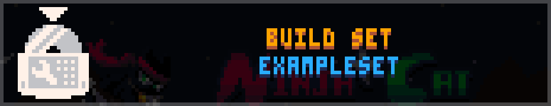

# Setup

You will need:
- Ogmo Editor 3 (from [here](https://ogmo-editor-3.github.io/) or a compatible version)
- Ninja Cat Remewstered V1.2mg or higher

## Required Information

The Pakify Folder is in the following locations:
- Windows: `C:\Users\<user>\AppData\Roaming\cubee\ninjacat\pakify`
- Linux: `/home/<user>/.config/cubee/ninjacat/pakify`
- Linux (Steam Flatpak): `/home/<user>/.var/app/com.ValveSoftware.Steam/.config/cubee/ninjacat/pakify`

The Pakify Folder is only for developing Level Sets. To play Level Sets from outside the Workshop, add them to the Custom Levels Folder instead:
- Windows: `C:\Users\<user>\AppData\Roaming\cubee\ninjacat\customLevels`
- Linux: `/home/<user>/.config/cubee/ninjacat/customLevels`
- Linux (Steam Flatpak): `/home/<user>/.var/app/com.ValveSoftware.Steam/.config/cubee/ninjacat/customLevels`

The Pakify Folder should be formatted like so (items with a trailing `/` are folders):
- `pakify/` < Pakify Folder
  - `.assets/` < Ogmo Project assets folder
  - `setA/` < Level Set
  - `setB/` < Level Set
  - `setC/` < Level Set
  - `ninja-cat-remewstered.ogmo` < [Ogmo Project](Ogmo%20Project.md)

Level Sets use the following structure, using `setA` as an example:
- `setA/` < Level Set
  - `regionA/` < Region Folder
    - `levelA.json` < Ogmo Levels
    - `levelB.json`
    - `order.json` < Level Order
    - `region.json` < [Region Properties](Region%20Properties.md)
  - `regionB/` < Region Folder
    - `levelA.json` < Ogmo Level
    - `order.json` < Level Order
    - `region.json` < [Region Properties](Region%20Properties.md)
  - `preview.png`
  - `set.json` < [Set Properties](Set%20Properties.md)

That is, each "Set" of Region Packs is stored in its own folder. This is for organisational purposes, and so that it is possible to group Campaigns of sequential Regions as one distinct item.

Here's a visual for a Level Set folder:


And another for a Region folder:


Linux/SteamOS people: the above images were taken inside a Wine Prefix so Windows people can follow the exact path in the top bar; please use the Linux path unless you happen to be running the Windows version under Wine/Proton.

Pakify will Build sets directly into the Custom Levels Folder - if we build `setA`, then we will get the following structure:
- `customPacks/` < Custom Levels Folder
  - `setA/` < Level Set
    - `set.json` < Set Metadata
    - `regionA.ncl` < Region
    - `regionB.ncl` < Region

## Basic Workflow
Usage of Ogmo Editor itself will not be covered here.

### Prerequisites
Place the `.ogmo` file and `.assets` folder from this repository into your Pakify Folder, like so:
- `pakify/`
  - `.assets/`
  - `ninja-cat-remewstered.ogmo`

These files are required for level creation and are not included with the game. To obtain them:
- Go to the main [GitHub Page](https://github.com/cubee-cb/ncr-pakify/).
- Click the green `Code` button and then `Download ZIP`.
- Place the ZIP file into the Pakify Folder, then extract it.
  - If the ZIP gets extracted into its own sub-folder, move its content back into the Pakify Folder.

### Steps
There is an example Level Set included, [`exampleSet`](../exampleSet).
- You can copy this folder directly into your Pakify Folder if you like.

#### If you're making a new Level Set or Region:
- Go to the Level Pakify Folder.
- Create the Structure for your Level Set or Region.
  - See [Required Information](#required-information) for file structure.
  - See [Set Properties](Set%20Properties.md) and [Region Properties](Region%20Properties.md) for templates.


#### To create a Level for a Region:
- Open the Ogmo Editor, then press "Open Project" and find the `.ogmo` project file.
- Find the Region's folder, then right click it and press **Create Level Here**. Name it whatever you like.
  - Remember to add it into the Region's `order.json`. See [Alternate Levels](Alternate%20Levels.md) for replacing the level layout depending on the selected modifiers.


#### To Pakify your Level Set:
- Open Ninja Cat Remewstered.
- Go to the Title Screen, open the System Menu, and select `Pakify`.
  - Or from `Options` anywhere: `Options` > `Technical` > `Pakify`


- Select the Level Set to run through Pakify, then select `Build`.
  - !! You will be returned to the title screen automatically when it finishes.





- Once complete, go to `New Game` in the main menu and see if your Regions are there.


#### Publishing to Steam Workshop:
Sets can only be published to the Steam Workshop using the Steam build of the game, while it is connected to Steam.
- To check if this is the case, either see if the Sets listed by Pakify have a Publish option, or check if the console output has `connected to steam!` followed by a greeting (e.g. `hello cubee!`).

You can set a preview image to show on the Workshop by adding `preview.png` next to your `set.json`.
Preview images use your cloud storage, so If you plan to upload lots of Level Sets, please keep the file size low. Let me know if you run out of space, and I may consider increasing it.

Next:
- Go to the Title Screen, open the System Menu, and select `Pakify`.
  - Or from `Options` anywhere: `Options` > `Technical` > `Pakify`


- Select the Level Set you want to publish, then select `Publish/Update set`.
  - If the Level Set has already been published, it will be updated instead.
    - If the item was deleted from Steam Workshop, the game will attempt to create a new item instead.
  - !! You will be returned to the title screen automatically when it finishes.


- Pakify will build the Level Set and upload it to the Workshop using the details specified in `set.json`. This may take a few moments.
  - The Set will have a `workshop.json` file added to its project folder. Do not remove or modify this unless you want to upload the Level Set again as a new item.
  - This will not build the pack to the Custom Levels folder; you will need to Pakify Build separately to update your local copy.
  - If the upload fails, please check Troubleshooting below.

- Once complete, Steam will open your new Workshop page.
  - Here you can change the visibility of your Level Set. By default it will be set to Hidden, meaning other players cannot see it. Change this to Friends-only or Publish when you're ready to share it with others!
  - If you haven't set `title` and `description` in the `set.json`, you can update these through Steam. *Remember that these fields will overwrite any changes you make in Steam, if present.*

## Troubleshooting

Common stuff:
- Double- and triple-check your files for incorrect filenames, missing commas or brackets, and general syntax errors.
- Try running Ninja Cat Remewstered through a console. This will provide detailed output about what exactly Pakify or the Level Set importer is failing on -> look for lines tagged with `[pakify]` or `[pakify (ERROR)]`.

### **Pakify Failed!**

- Make sure your Regions have both `region.json` and `order.json`.

### **Region does not appear in the `New Game` menu**

- Make sure the Region files are formatted correctly, and `region.json` exists with valid content.

### **A level or alternate is missing!**

- Check `order.json` and ensure that you spelt its name and/or condition correctly.

### **Pakify doesn't see the Level Set!**

- Make sure it's in the Pakify Folder (**NOT** the Custom Levels folder) and contains a properly-formatted `set.json`.

### **Publish fails**

- Make sure your files are formatted correctly.
- Check that you have agreed to the Steam Subscriber Agreement / Workshop Terms of Service.

### **What does "running through a console" mean?**

Please research "how to run applications through console linux/windows", it's fairly straightforward.
- For Windows, you would use CMD or PowerShell.
- For Steam Deck and other systems running KDE Plasma, it's most likely Konsole.
- For other Linux users, it depends on what exact flavour of Linux you have.

## `order.json` example
Format:
- `<filename>` - e.g. `epicLevel1.json`
- `<filename>:<alternate>` - e.g. `epicLevel1.json:pacifism`

The indentation here is optional; I use it to more easily tell which levels are Alternates.
```json
[
  "1.json",
  "2.json",
    "2-goldrush.json:goldRush",
  "3.json"
]

```
