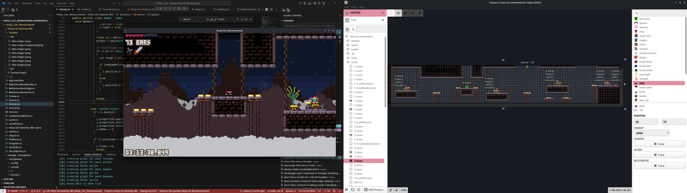

# ncr-pakify

Documentation and tools to help make Custom Levels for Ninja Cat Remewstered.

Included is an Ogmo project with all of the entities and tilesets already set up.

See [the wiki folder](wiki) for [documentation](wiki/README.md).

## Notes
- Workflows are untested on Windows. They should work in theory. Feel free to help test and/or contribute fixes!
- `.ncl` is short for Ninja Cat Level. A holdover from early development where each level was an individual file instead of being grouped in packs. They are just `json` files internally, but the extension makes it more obvious what the file is for.
- `basepak` might seem to contain no levels. This is because its `base.ncl` is pre-generated with all the levels included, made inside PICO-8 directly from the original game's map data rather than from an Ogmo project.
